# AWS Three-Tier Web Architecture

## Project Overview

This project demonstrates how to build a production-style three-tier web architecture in AWS.

## Architecture

(insert architecture diagram)

## Technologies

- Amazon VPC
- EC2
- Auto Scaling
- Application Load Balancer
- Amazon RDS
- Security Groups
- IAM

## Step 1 - Create the VPC

Created a custom VPC named three-tier-vpc using the CIDR block 10.0.0.0/16.

### Screenshot 1 - VPC Created

### Screenshot 2 - DNS Settings

### Screenshot 3 - Internet Gateway Attached

### Why?

A custom VPC provides complete control over networking, routing, and security.

---

## Phase 2 - Create Public and Private Subnets

Six subnets were created across two Availability Zones to support high availability and isolate the presentation, application, and database tiers.

### Subnet Design

| Subnet | CIDR Block | Purpose |
|---|---|---|
| public-subnet-az1 | 10.0.1.0/24 | Public-facing infrastructure in AZ1 |
| public-subnet-az2 | 10.0.2.0/24 | Public-facing infrastructure in AZ2 |
| app-subnet-az1 | 10.0.11.0/24 | Application servers in AZ1 |
| app-subnet-az2 | 10.0.12.0/24 | Application servers in AZ2 |
| db-subnet-az1 | 10.0.21.0/24 | Database resources in AZ1 |
| db-subnet-az2 | 10.0.22.0/24 | Database resources in AZ2 |

### Screenshot 1 - Six Subnets Created

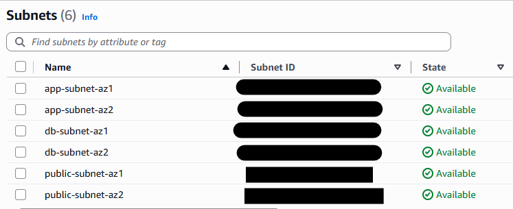

### Screenshot 2 - Subnets Across Two Availability Zones

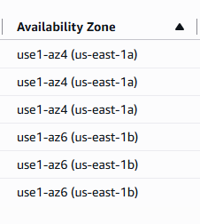

### Screenshot 3 - Private Subnet Details

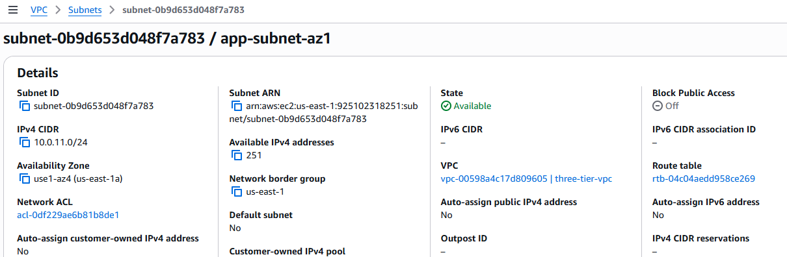

### Why?

Separating the architecture into public, application, and database subnets limits direct exposure to the internet. Distributing the subnets across two Availability Zones also improves resilience and prepares the environment for a highly available load balancer, Auto Scaling group, and RDS deployment.

### Cloud Engineer Notes

- Designed a three-tier network architecture using dedicated public, application, and database subnets.
- Distributed resources across two Availability Zones to improve availability and resilience.
- Reserved private subnets for application and database resources to minimize internet exposure.
- Prepared the network for an Application Load Balancer, Auto Scaling Group, NAT Gateway, and Amazon RDS deployment.
  
## Phase 3 - Configure Route Tables

Three custom route tables were created to control traffic for the public, application, and database tiers.

### Route Table Design

| Route Table | Subnets | Internet Route |
|---|---|---|
| public-rt | public-subnet-az1 and public-subnet-az2 | 0.0.0.0/0 → Internet Gateway |
| app-private-rt | app-subnet-az1 and app-subnet-az2 | Local route only |
| db-private-rt | db-subnet-az1 and db-subnet-az2 | Local route only |

### Screenshot 1 - Route Tables Created

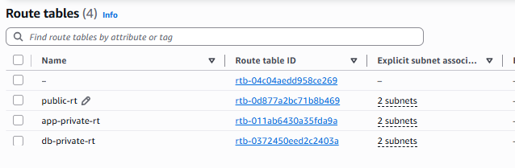

### Screenshot 2 - Public Internet Route

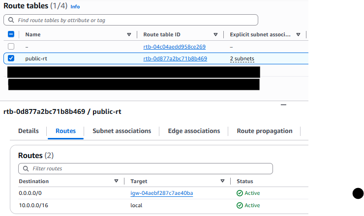

### Screenshot 3 - Public Subnet Associations

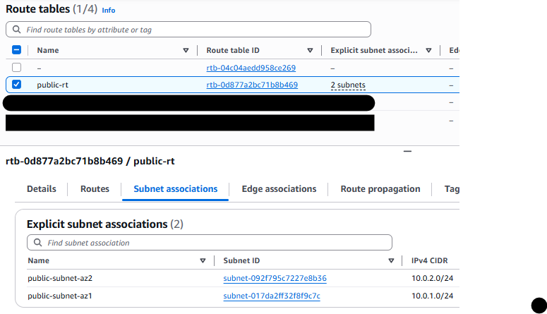

### Screenshot 4 - Private Route Table Associations

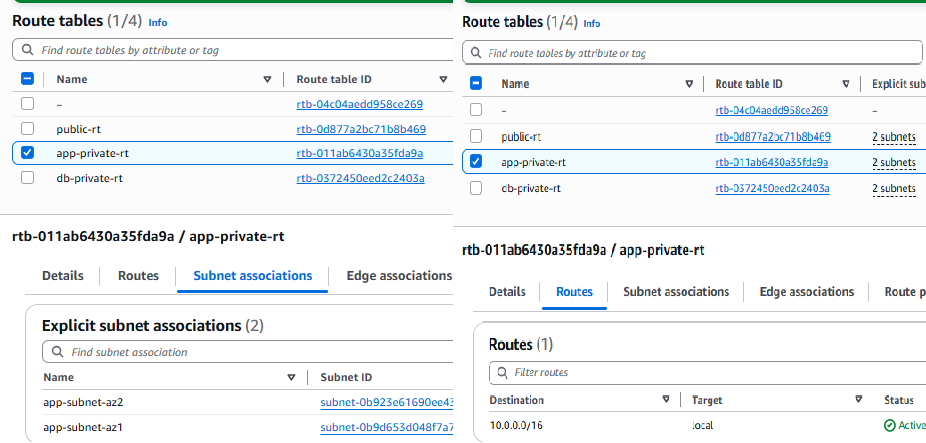

### Why?

The public route table sends internet-bound traffic to the Internet Gateway, making its associated subnets public. The application and database route tables currently contain only the local VPC route, preventing direct internet access and maintaining separation between the architecture tiers.

## Phase 4 - Configure NAT Gateway

A public NAT Gateway was deployed to provide secure outbound internet access for application servers hosted in private subnets. The NAT Gateway allows EC2 instances to download updates and access external services without exposing them directly to inbound internet traffic.

### Screenshot 1 - Elastic IP Allocated

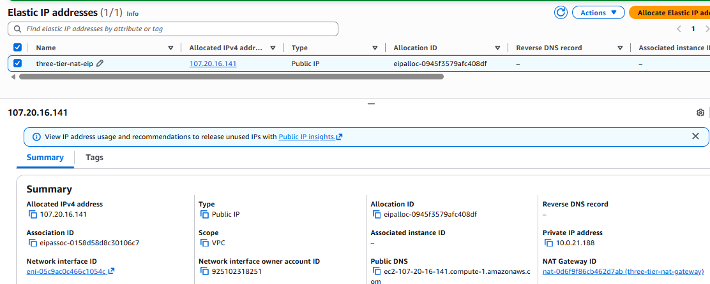

### Screenshot 2 - NAT Gateway Available

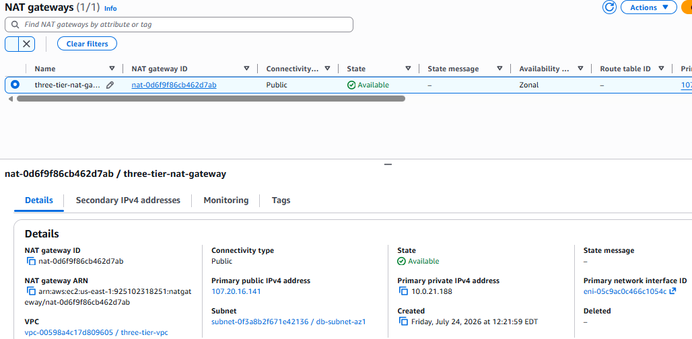

### Screenshot 3 - Application Route Table

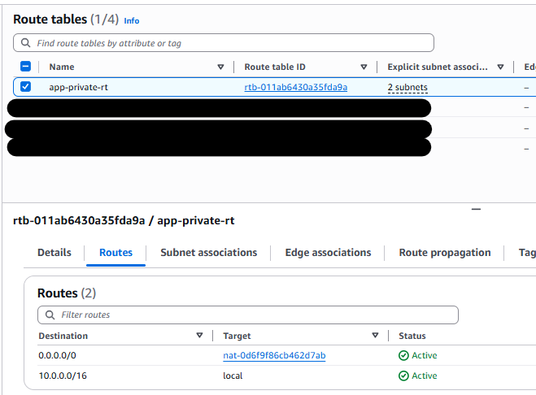

### Screenshot 4 - Database Route Table

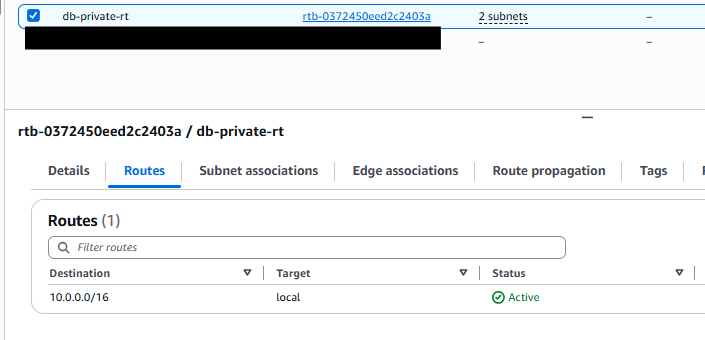

### Why?

A NAT Gateway provides outbound internet connectivity for private resources while blocking unsolicited inbound connections. This design follows AWS security best practices by keeping application servers private while still allowing them to access software repositories and AWS services. The database subnets remain isolated to reduce the attack surface.

### Cloud Engineer Notes

- Allocated an Elastic IP for the NAT Gateway.
- Deployed a public NAT Gateway.
- Updated the application route table to route outbound traffic through the NAT Gateway.
- Left the database route table isolated with only the local VPC route.

### Skills Demonstrated

- Amazon NAT Gateway
- Elastic IP
- Route Tables
- Private Networking
- Secure Internet Access
- AWS Networking Best Practices

## Phase 5 - Configure Security Groups

Three security groups were created to implement layered network security across the three-tier architecture.

### Security Group Design

| Security Group | Purpose |
|---------------|---------|
| alb-sg | Allows inbound HTTP traffic from the internet |
| app-sg | Allows HTTP traffic only from the Application Load Balancer |
| db-sg | Allows MySQL connections only from the EC2 application servers |

### Screenshot 1 - Security Groups Created

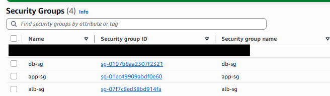

### Screenshot 2 - ALB Security Group

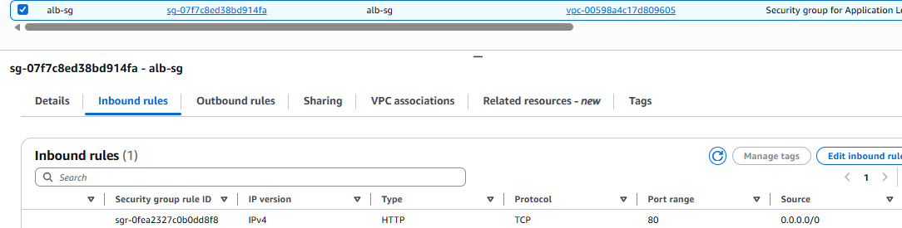

### Screenshot 3 - Application Security Group

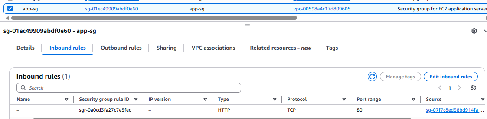

### Screenshot 4 - Database Security Group

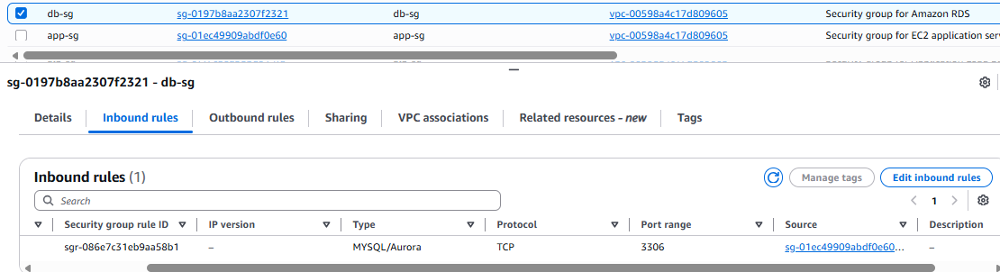

### Why?

Using separate security groups for each tier enforces the principle of least privilege. The Application Load Balancer is the only component exposed to the internet, application servers accept traffic only from the load balancer, and the database accepts connections only from the application tier. This layered approach improves security and reduces the attack surface.

### Cloud Engineer Notes

- Created dedicated security groups for each architecture tier.
- Used security group references instead of CIDR blocks for internal communication.
- Restricted direct access to application servers and the database.
- Implemented layered network security following AWS best practices.

### Skills Demonstrated

- Amazon VPC Security Groups
- Least Privilege Access
- Layered Network Security
- Application Load Balancer Security
- EC2 Security
- Amazon RDS Security

## Phase 6 - Launch EC2 Web Server

A private Amazon EC2 instance was launched in the application subnet to host the web application. The instance was configured using EC2 User Data to automatically install the Apache web server, enable the service at boot, and deploy a custom HTML page displaying the instance ID and Availability Zone.

### Screenshot 1 - EC2 Launch Configuration

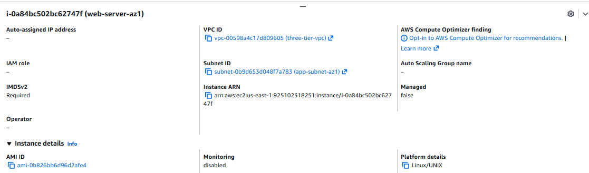

### Screenshot 2 - EC2 Instance Running

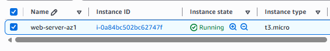

### Screenshot 3 - EC2 Networking

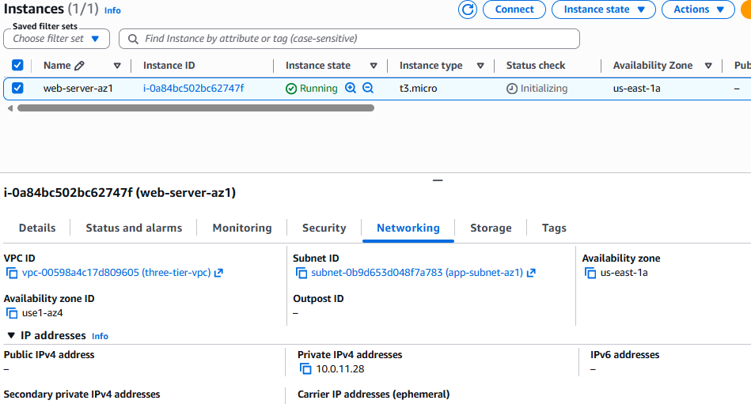

### Why?

The EC2 instance was deployed in a private application subnet to prevent direct internet access while allowing traffic only from the Application Load Balancer. During launch, a User Data script automatically configured the web server, demonstrating infrastructure automation and reducing the need for manual server configuration.

### Cloud Engineer Notes

- Launched an Amazon Linux 2023 EC2 instance in a private application subnet.
- Associated the instance with the `app-sg` security group.
- Disabled public IP assignment to keep the instance private.
- Used EC2 User Data to automatically install and configure Apache.
- Prepared the instance to become the golden image for the Auto Scaling Group.

### Skills Demonstrated

- Amazon EC2
- Amazon Linux 2023
- EC2 User Data
- Infrastructure Automation
- Private Subnet Deployment
- Apache HTTP Server
- Security Groups

  ## Phase 7 - Configure Application Load Balancer

An internet-facing Application Load Balancer (ALB) and Target Group were deployed to distribute incoming HTTP requests to the private EC2 application server. Health checks verified that the application was successfully deployed and responding to client requests.

### Screenshot 1 - Target Group Created

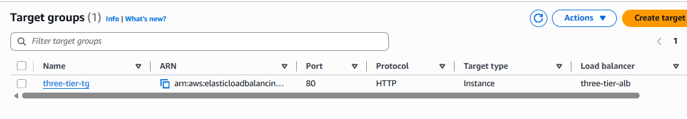

### Screenshot 2 - Registered Target (Healthy)

### Screenshot 3 - Application Load Balancer Active

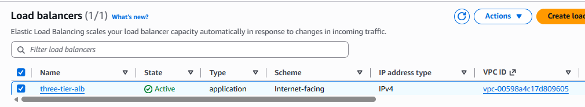

### Screenshot 4 - Website Accessed Through ALB

### Why?

The Application Load Balancer acts as the single entry point for web traffic, distributing requests across application servers while continuously monitoring their health. This improves scalability, availability, and fault tolerance by ensuring traffic is only sent to healthy instances.

### Cloud Engineer Notes

- Created an Application Load Balancer in two public subnets.
- Configured an HTTP listener on port 80.
- Created a Target Group using instance targets.
- Registered the EC2 application server with the Target Group.
- Verified successful health checks and application accessibility through the ALB DNS name.

### Skills Demonstrated

- Application Load Balancer (ALB)
- Target Groups
- Health Checks
- High Availability
- Layer 7 Load Balancing
- AWS Networking
