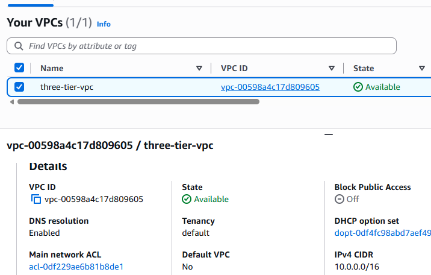
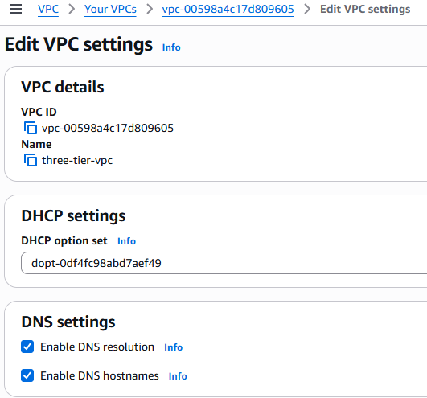
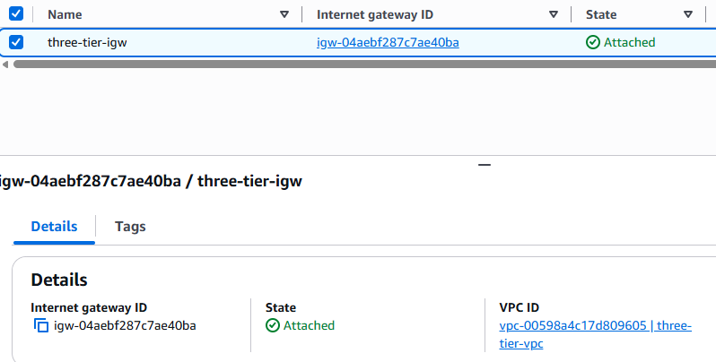

# AWS Three-Tier Web Architecture

## Project Overview

This project demonstrates how to build a production-style three-tier web architecture in AWS.

## Architecture

(insert architecture diagram)

## Technologies

- Amazon VPC
- EC2
- Auto Scaling
- Application Load Balancer
- Amazon RDS
- Security Groups
- IAM

## Step 1 - Create the VPC

Created a custom VPC named three-tier-vpc using the CIDR block 10.0.0.0/16.

### Screenshot 1 - VPC Created

### Screenshot 2 - DNS Settings

### Screenshot 3 - Internet Gateway Attached

### Why?

A custom VPC provides complete control over networking, routing, and security.

---

## Step 2 - Create Public and Private Subnets

(insert screenshots)

Explanation...

---

## Step 3...

...
